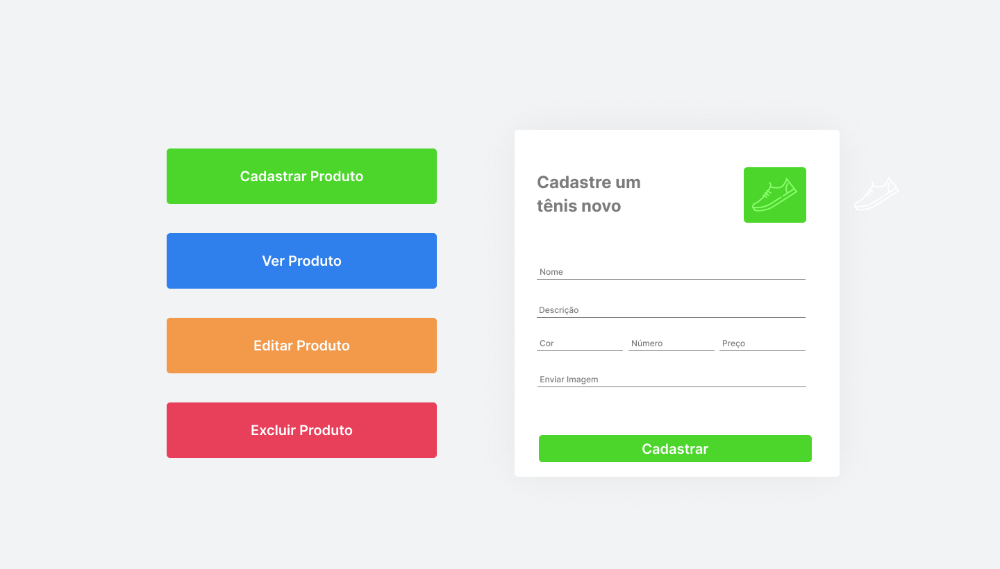
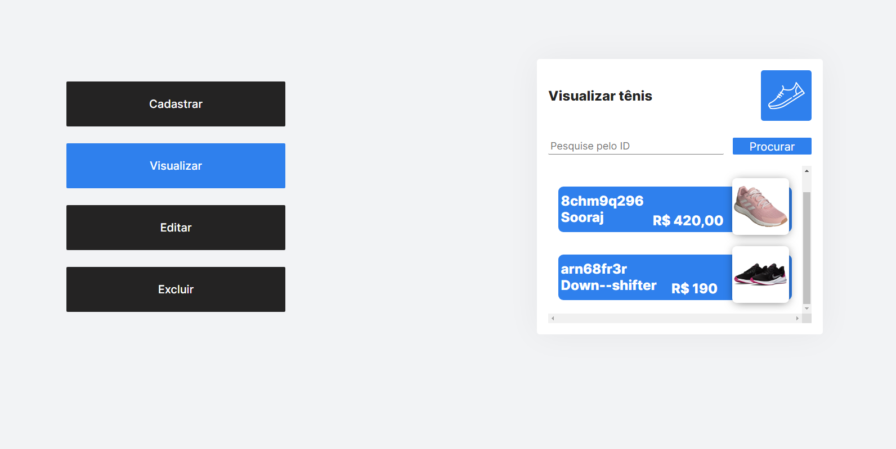
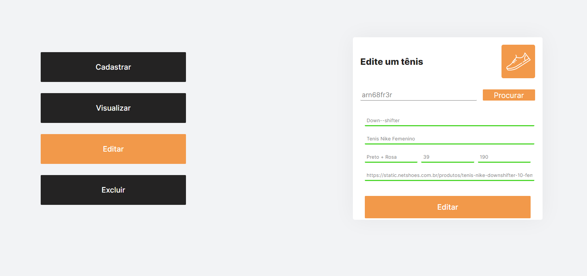
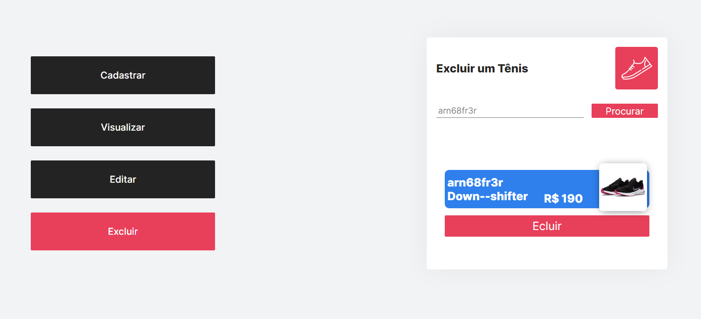
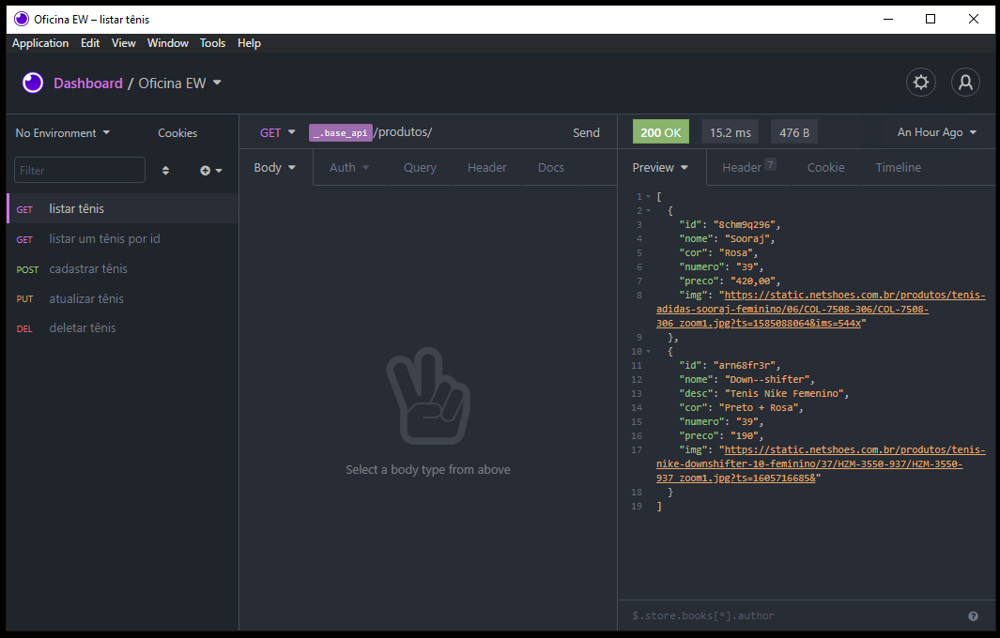
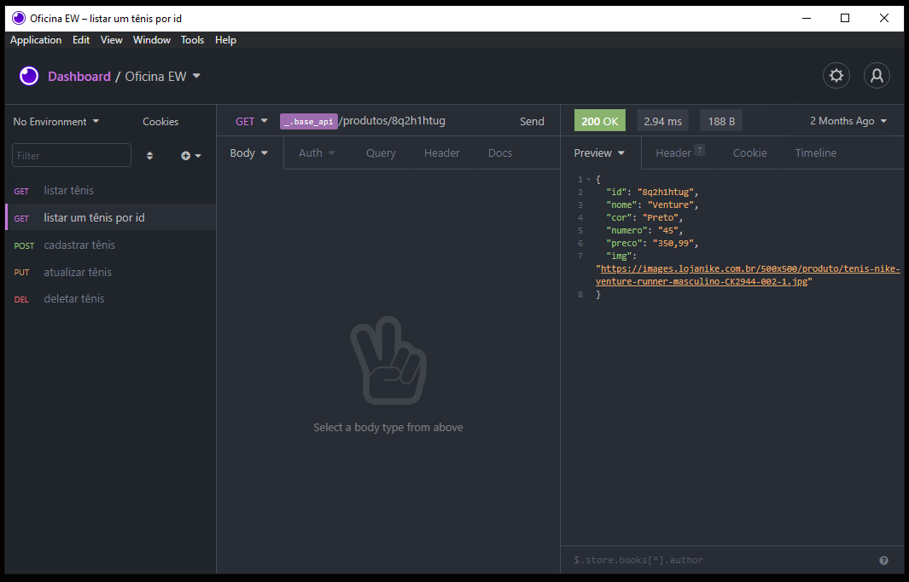
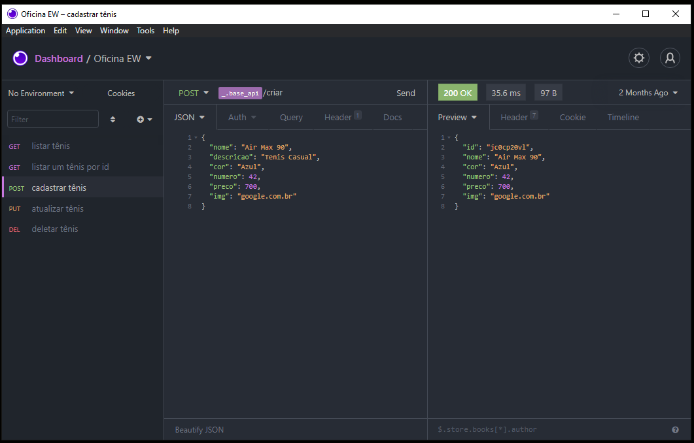
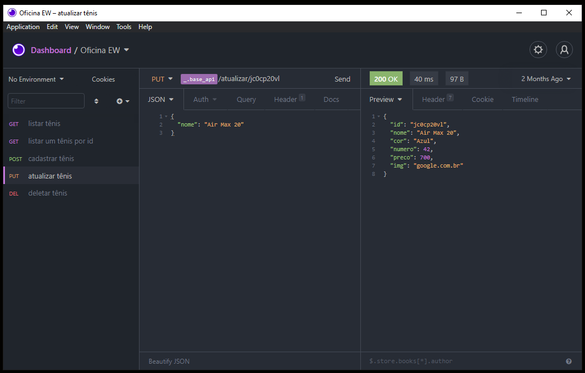
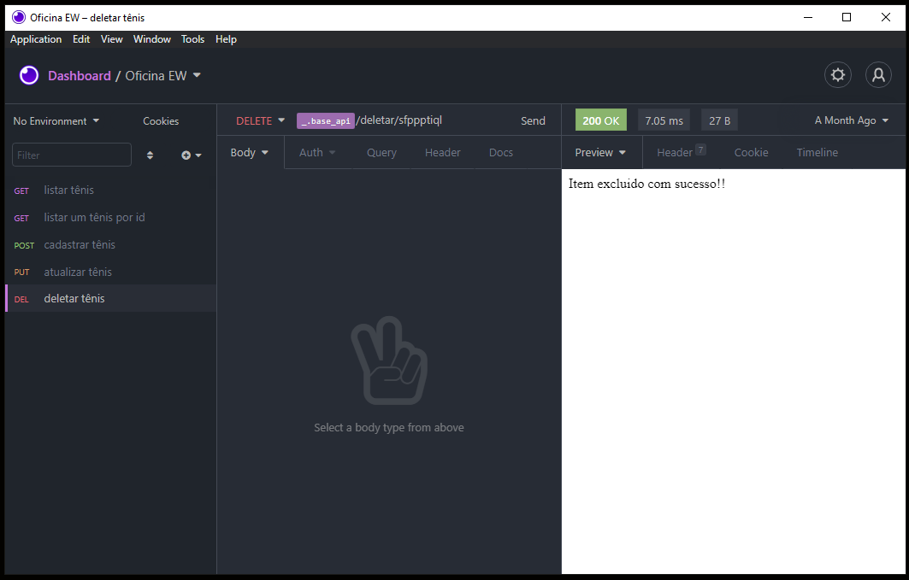

  <h1 align="center" >
          
     Crud Loja de Tenis - Back-end e Front-end </h1> 
  
 
Print da Interface

   
  
 
Prints da interface

 

   
   
   
   
  

  
   
Print back-end

 

   
   
   
   
   
  

  

  

<h1>🚀 Tecnologias</h1>
 

Esse projeto é um estudo de Front End e Back End usando as seguintes tecnologias:

<h2>Protótipo</h2> 
 - ✔️ Figma  
<h2>Back End</h2>
- ✔️ Javascript  
- ✔️ NodeJs  
- ✔️ Express  
- ✔️ Mongoose  
- ✔️ JSON  
<h2>Front End</h2>
- ✔️ Javascript  
- ✔️ ReactJS  
- ✔️ React Hooks  
- ✔️ Axios  
- ✔️ HTML  
- ✔️ CSS  

<h1>📝Observações</h1>

Como a queria fazer uma API simples para utilizar no front-end. Utilizei um banco de dados simples, salvando em JSON

 

 

<h1>ℹ️ Como usar</h1>

<pre>

# Clone o repositorio
$ git clone https://github.com/Ulisses97/CRUD-Tenis.git

# Entre no repositorio 
$ cd CRUD-Tenis

# Primeiro instale as dependencias do back-end, 
$ cd api

# Instale as dependência
$ npm install ou utilize yarn

# Agore instale as dependencias do front-end, 
$ cd loja-tenis

# Instale as dependência
$ npm install ou utilize yarn

# Execute o back-end
$ npm start

# Execute o front-end
$ yarn start

<footer>
Feito com o ♥ por <a href="https://www.instagram.com/ulisses.brandao/">Ulisses Brandão</a>👋
  

☕Bora tomar um café e conversar melhor?
</footer>
